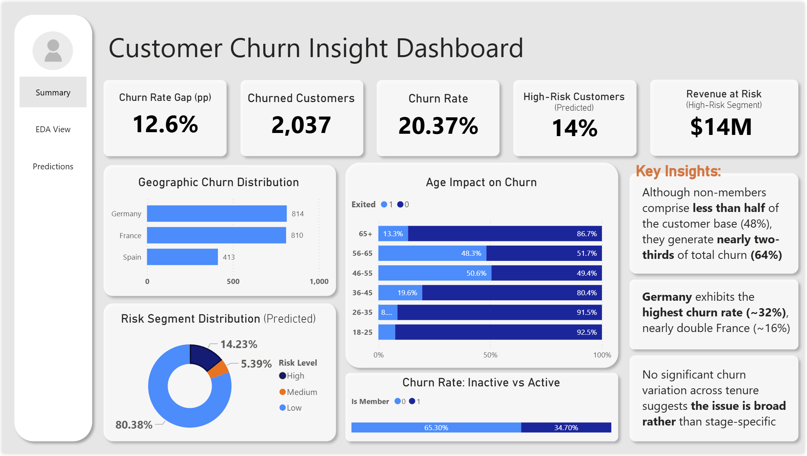
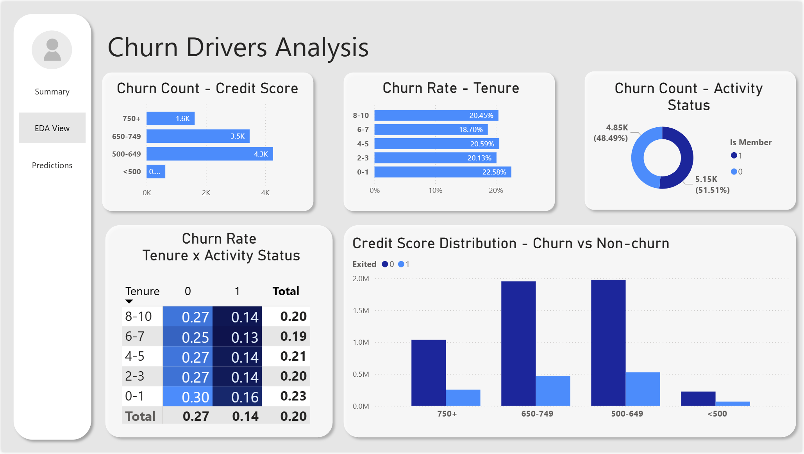
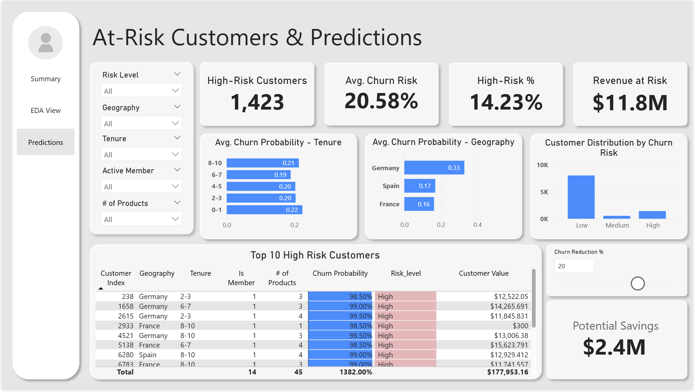

## 📊 Customer Churn Prediction & Risk Segmentation Dashboard
### Project Summary
This project analyzes customer churn behavior for a European retail bank and builds a predictive model to identify high-risk customers. The model outputs are executed into buisness-friendly Power BI dashboard to support strategy and quanitfy revenue at risk.

The object was not only to predict churn, but to translate model outputs into actionable business insights.
***
### Business Context
Customer churn directly reduces recurring revenue and increases customer acquisition costs.

This project addresses the following business questions:
- Which customer attributes are most predictive of churn?
- Which segments exhibit the largest churn rate gaps?
- Which customers are at high risk of churn (>=70% probability)?
- What is the estimated financial exposure from high-risk customers?
- How much revenue could potentially be retained through targeted intervention?
***
### Key Insights
- Inactive customers exhibit 13 percentage-point churn gap relative to active members, indicating engagement status is a stronger predictor of churn.
- Multiple-product (3-4) customers are disproportionately represented among churners.
- Middle-aged customers (45-54 yrs) show elevated churn probability compared to younger segments.
- High-risk customers account for a concentrated portion of projected revenue exposure.
***
### Power BI Dashboard

***
### Methodology
***
### 1. Data Preparation
- Removed non-predictive identifiers
- Verified data types and handled categorical encoding
- Checked for missking or anomalous values
- Created engineered features (age bands, tenure bands, credit score bands)
***
### 2. Exploratory Data Analysis (EDA)
Key findings:
- Overall churn rate = 20%
- Inactive members exhibit significantly higher churn rates
- Customers with 3-4 products show disproportionately high churn
- Age 45-54 segment shows elevated churn likelihood
- Geographic difference reveal systematic churn gaps EDA focused on identifying **churn rate gaps (percentage-point differences from overall churn)** to surface actionable segments.
***
### 3. Predictive Modeling
Models evaluated:
- Logistic Regression
- Random Forest Classifer
Performance Metrics:
- ROC-AUC > 0.80
- Random Forest selected for deployment due to stronger predictive performance

\*The model generates churn probability scores for each customer.
***
### 4. Risk Segmentation
Customers were categorized into risk tiers based on churn probability:
- High Risk: >= 70%
- Medium Risk: 40-69%
- Low Risk: < 40%

\*High-risk customers were exported to a structured dataet for dashboard integration and business review
***
### 5. Financial Impact Estimation
Since the dataest did not include customer lifetime value, a revenue proxy was estimated using available financial attributes.

Calcuated metrics:
- Expected Revenue at Risk (probability-weighted exposure)
- High-Risk Segment Exposure
- Potential Retention Savings (if intervention reduces churn)
***
### Dataset
**Source**: Kaggle - European Bank Customer Churn Dataset  
**Size**: 10,000 customers

Key features include:
- Geography
- Age
- Credit Score
- Tenure
- Number of Products
- Balance
- Estimated Salary
- Active Member Status
- Churn Indicator (Exited)
***
### Tech Stack
- Python: pandas, numpy, matplotlib, scikit-learn
- Machin Learning: Logistic Regression, Random Forest
- Visualization: Power BI

